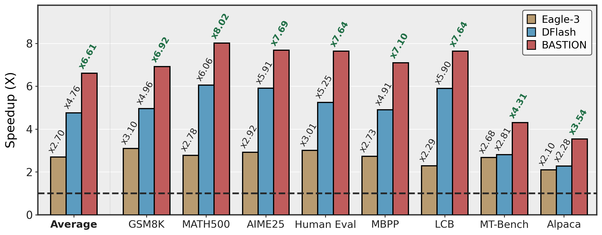

# BASTION: Budget-Aware Speculative Decoding with Tree-structured Block Diffusion Drafting

[](https://www.python.org/)
[](LICENSE)
[](https://arxiv.org/abs/TODO)

Official code release for **BASTION: Budget-Aware Speculative Decoding with Tree-structured Block Diffusion Drafting**.

> **Up to 6.61× speedup over autoregressive decoding** — 2.45× over EAGLE-3 and 1.39× over DFlash, averaged across eight math/code/chat benchmarks on Qwen3-8B at temperature 0 (A100).

<p align="center">
  
</p>

BASTION accelerates block-diffusion speculative decoding by building a query-dependent verification tree from the drafter's position-wise logits. The public release focuses on the paper's **Transformers backend** reproduction path: DFlash block-diffusion drafters, BASTION adaptive tree construction, hardware-calibrated verification latency modeling, and benchmark scripts.

## Scope

This repository is intended for experiment reproduction, not as a general serving framework. The current public release supports:

- Transformers backend only
- batch size 1 experiments
- Qwen3-4B, Qwen3-8B, and Llama-3.1-8B-Instruct target models
- DFlash draft models released on Hugging Face
- automatic per-(GPU, target model) calibration and profiling cache creation

SGLang, vLLM, and MLX backends are not part of this BASTION release.

## Requirements

- **Python:** 3.10 or newer
- **GPU:** NVIDIA GPU with CUDA support (bf16). Tested on A100 (80 GB), H100 (80 GB), A6000 (48 GB), and RTX PRO 6000 Blackwell (96 GB).
- **VRAM:** ~20 GB for Qwen3-4B targets, ~24 GB for Qwen3-8B / Llama-3.1-8B targets in bf16.
- **PyTorch / Transformers:** `transformers==4.57.1` and a matching `torch` build (installed via the `[transformers]` extra).
- **Optional:** FlashAttention (`flash-attn`) for faster AR and DFlash baselines.

## Installation

Create a fresh `uv` environment and install the Transformers reproduction dependencies:

```bash
uv venv
source .venv/bin/activate
uv pip install -e ".[transformers]"
```

For faster AR and DFlash baselines, install FlashAttention separately if it is compatible with your system:

```bash
uv pip install flash-attn --no-build-isolation
```

### Attention backends

- If FlashAttention is installed, AR baseline and DFlash use `flash_attention_2`.
- BASTION verification always uses `sdpa`, even when FlashAttention is installed — FlashAttention does not support the custom tree attention mask.
- If FlashAttention is not installed, all three modes use `sdpa`.

## Supported Models

| Target model | DFlash draft model | Notes |
|---|---|---|
| `Qwen/Qwen3-4B` | `z-lab/Qwen3-4B-DFlash-b16` | non-thinking only — do not pass `--enable-thinking` |
| `Qwen/Qwen3-8B` | `z-lab/Qwen3-8B-DFlash-b16` | non-thinking only — do not pass `--enable-thinking` |
| `meta-llama/Llama-3.1-8B-Instruct` | `z-lab/LLaMA3.1-8B-Instruct-DFlash-UltraChat` | gated — accept the license and run `huggingface-cli login` |

## Quick Start

Run a small reproduction slice on GSM8K:

```bash
python -m bastion.benchmark \
  --model Qwen/Qwen3-8B \
  --draft-model z-lab/Qwen3-8B-DFlash-b16 \
  --dataset gsm8k \
  --max-samples 128 \
  --max-new-tokens 2048 \
  --temperature 0.0
```

The script compares three modes in one run:

- AR baseline (`block_size=1`)
- DFlash single-path speculative decoding
- BASTION adaptive tree-drafting

> **First-run note:** The first invocation for each `(GPU, target model)` pair runs a one-time calibration probe (a few minutes) before benchmarking, and writes three files under `cache/`:
> `calib_probe_<gpu>_<model>.sigma_sequence_v1.jsonl`, `calibration_<gpu>_<model>.json`, `calibration_<gpu>_<model>.profile.json`.
> Subsequent runs reuse them. Delete the corresponding files to recalibrate after changing hardware, CUDA kernels, model dtype, or attention backend.

## Reproducing Paper Benchmarks

Supported `--dataset` values:

- **Short-context:** `gsm8k`, `math500`, `aime25`, `humaneval`, `mbpp`, `lcb`, `mt-bench`, `alpaca`
- **LongBench (English):** `qasper`, `multifieldqa_en`, `gov_report`, `multi_news`, `triviaqa`, `samsum`, `passage_retrieval_en` (also accepted with a `longbench-` prefix)
- **Group aliases:** `paper-short` (all eight short-context benchmarks in one run) and `longbench` (all seven LongBench subsets in one run). Useful for a single combined number; use the per-dataset loop below to reproduce the paper's per-dataset table.

For per-dataset reporting, loop over dataset names (swap the list for the LongBench subsets to reproduce the long-context table):

```bash
for dataset in gsm8k math500 aime25 humaneval mbpp lcb mt-bench alpaca; do
  python -m bastion.benchmark \
    --model Qwen/Qwen3-8B \
    --draft-model z-lab/Qwen3-8B-DFlash-b16 \
    --dataset "$dataset" \
    --max-new-tokens 2048 \
    --temperature 0.0   # set to 1.0 for stochastic decoding
done
```

## Multi-GPU Runs

The paper reports single-GPU, batch-size-1 measurements. `torchrun` can shard prompts across multiple GPUs to collect benchmarks faster, but each rank still runs batch size 1 on its assigned GPU:

```bash
torchrun --nproc_per_node=8 -m bastion.benchmark \
  --model Qwen/Qwen3-8B \
  --draft-model z-lab/Qwen3-8B-DFlash-b16 \
  --dataset gsm8k \
  --max-new-tokens 2048 \
  --temperature 0.0
```

Behavior across ranks: prompts are sharded round-robin by rank. Rank 0 creates the calibration cache on first run; other ranks wait for it. Per-rank results are gathered to rank 0, which prints the combined summary table.

## Repository Layout

```
bastion/    # adaptive tree drafting, cost model, benchmark harness
dflash/     # vendored DFlash drafter implementation
cache/      # auto-created: dataset JSONLs + per-(GPU, model) calibration
```

Key files:

- `bastion/tree_draft.py` — adaptive best-first tree construction and BASTION generation
- `bastion/cost_model.py` — calibrated roofline verification-latency model
- `bastion/benchmark.py` — AR vs DFlash vs BASTION reproduction harness
- `dflash/model.py` — DFlash Transformers draft model used by BASTION

## Notes

- Datasets are downloaded through Hugging Face `datasets` and cached as JSONL files in `cache/`.
- Calibration is part of the official reproduction flow. BASTION does not use an uncalibrated fallback in this release.
- Throughput numbers can vary with GPU SKU, CUDA version, attention implementation, and driver/runtime state.

## Citation

```bibtex
@article{oh2026bastion,
  title         = {{BASTION: Budget-Aware Speculative Decoding with Tree-structured Block Diffusion Drafting}},
  author        = {Oh, Soowon and Cao, Nam and Kim, Yujin and Jung, Hojung and Ahmad, Huzama and Bae, Sangmin and Yun, Se-Young},
  year          = {2026},
  eprint        = {TODO},
  archivePrefix = {arXiv},
  primaryClass  = {cs.CL}
}
```

## Acknowledgements

BASTION builds on [DFlash](https://github.com/z-lab/dflash) block-diffusion drafters (z-lab) and compares against EAGLE-3 (via the [AngelSlim](https://github.com/tencent/AngelSlim) implementation). See the paper for full references.

## License

MIT — see [LICENSE](LICENSE).
